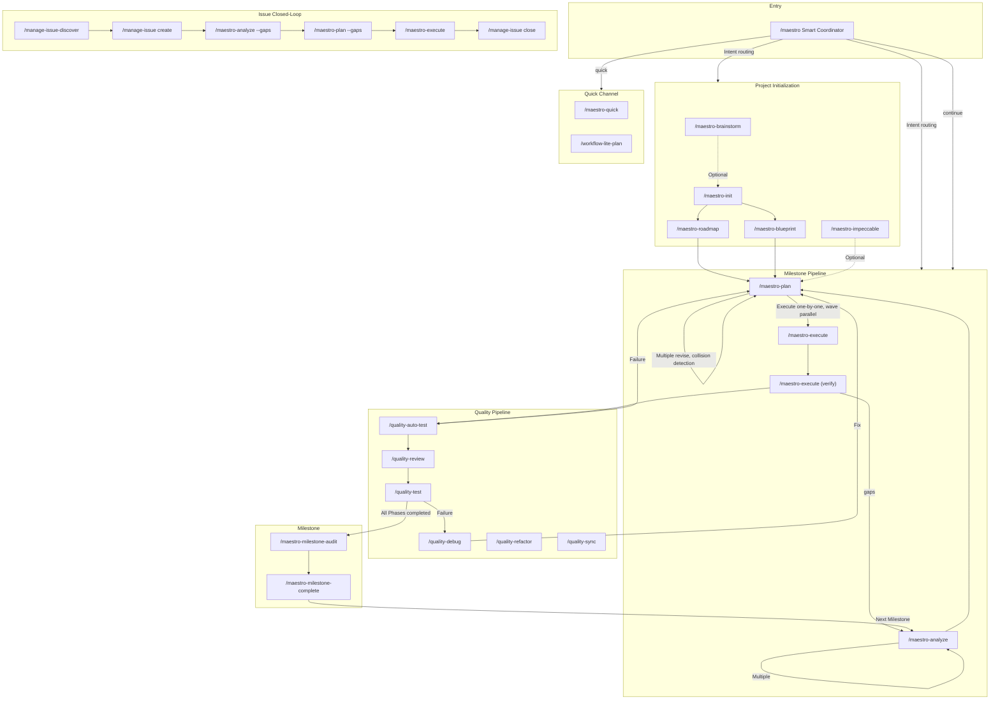
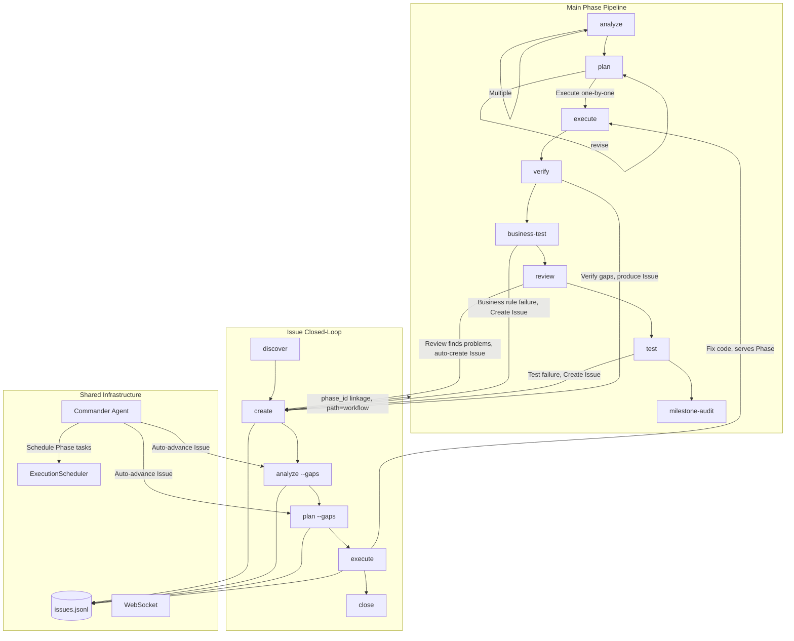

The Maestro command system includes 64 slash commands, organized into 7 major categories. This document provides the command panorama and core workflow navigation.

## Command Overview

| Category | Count | Prefix | Responsibility |
|----------|-------|--------|----------------|
| **Core Workflow** | 32 | `maestro-*` | Lifecycle engine (ralph), initialization, planning, execution, verification, coordination, milestones, overlays, swarm, companion |
| **Management** | 10 | `manage-*` | Issue lifecycle, codebase documentation, knowledge capture, memory, harvest, status, knowledge-audit |
| **Quality** | 7 | `quality-*` | Code review, business testing, UAT, debugging, refactoring, retrospective, sync |
| **Specification** | 4 | `spec-*` | Project spec initialization, loading, entry, analytics |
| **Learning** | 4 | `learn-*` | Unified retro (git+decision), follow-along, pattern decompose, investigate |
| **Odyssey** | 5 | `odyssey-*` | Academic research workflows — lit-review, experiment, paper-draft, data-pipeline, thesis-structure |
| **Security** | 1 | `security-*` | Security audit |

The global entry point `/maestro` is the smart coordinator that automatically selects the optimal command chain based on user intent and project state.

---

## Command Panorama



---

## Interaction Between Main Pipeline and Issues



### Two Issue Processing Paths

| path | Meaning | Source | Lifecycle |
|------|---------|--------|-----------|
| `standalone` | Independent Issue, not bound to a Phase | Manual creation, `/manage-issue-discover`, external import | Independent closed-loop, does not affect Phase progression |
| `workflow` | Phase-linked Issue | `quality-review` auto-create, `quality-auto-test` failure, Phase verification output | May block milestone completion |

---

## 1. Main Workflow

### Project Initialization

```
/maestro-init → /maestro-roadmap or /maestro-blueprint
```

| Step | Command | Purpose | Output |
|------|---------|---------|--------|
| 0 | `/maestro-brainstorm` (optional) | Multi-role brainstorming | guidance-specification.md |
| 1 | `/maestro-init` | Initialize .workflow/ directory | state.json, project.md, specs/ |
| 2a | `/maestro-roadmap` | Lightweight roadmap | roadmap.md |
| 2b | `/maestro-blueprint` | 6-stage specification blueprint | PRD + architecture docs + `.workflow/blueprint/` |

### Milestone Pipeline

```
analyze → plan → execute → verify → review → test → milestone-audit → milestone-complete
```

| Stage | Command | Output | Artifact |
|-------|---------|--------|----------|
| Analyze | `/maestro-analyze` | context.md, analysis.md | ANL-{NNN} |
| Plan | `/maestro-plan` | plan.json + TASK-*.json | PLN-{NNN} |
| Execute | `/maestro-execute` | .summaries/, code changes | EXC-{NNN} |
| Verify | `/maestro-execute` (E2.7) | verification.json | VRF-{NNN} |
| Audit | `/maestro-milestone-audit` | audit-report.md | — |
| Complete | `/maestro-milestone-complete` | archived to milestones/ | — |

**Scope routing**: No args = entire milestone; number = specific phase (micro mode); text = macro exploration (macro mode). `--dir` specifies upstream output path directly.

### Dual-Layer Analyze

| Layer | Argument | Purpose | Downstream Routing |
|-------|----------|---------|-------------------|
| **Macro** | text, e.g. `"user auth system"` | Requirement impact exploration, produces scope_verdict | large→roadmap, medium/small→plan |
| **Micro** | number, e.g. `1` | Phase-level 6-dimension deep analysis | Directly to plan |

```bash
# Macro: explore requirement impact before roadmap
/maestro-analyze "Implement multi-tenancy"     # → scope_verdict: large → suggests roadmap

# Micro: Phase-level deep analysis
/maestro-analyze 1                              # → 6-dimension scoring → directly to plan

# Pass upstream context
/maestro-analyze "Auth module" --from brainstorm:BRN-001
```

### Six Usage Modes

**A. Full milestone**: `analyze → plan → execute → verify` (one shot, all phases)

**B. Per-phase**: `analyze 1 → plan 1 → execute 1` (each phase independently, micro layer)

**C. Mixed**: Full analysis + per-phase execution + adhoc mid-stream

**D. Unified planning**: `analyze 1 → analyze 2 → plan → execute` (analyze first, plan once)

**E. Standalone**: `analyze "topic" → plan --dir → execute --dir` (no init/roadmap needed)

**F. Macro exploration**: `analyze "requirement"` → scope_verdict → roadmap or plan (macro layer, use before roadmap)

---

## 2. Quick Channel

```bash
/maestro-quick "Fix login page bug"              # Shortest path
/maestro-quick --full "Refactor API layer"       # With plan validation
/maestro-quick --discuss "Database migration"    # With decision extraction

# Scratch mode (no init required)
/maestro-analyze "Implement JWT auth"            # scope=standalone
/maestro-plan --dir scratch/20260420-analyze-xxx
/maestro-execute --dir scratch/20260420-plan-xxx

# Lite chain
/workflow-lite-plan "Implement Issue system"     # explore→plan→execute→test
```

---

## 3. Issue Closed-Loop

```
Discover → Create → Analyze → Plan → Execute → Close
```

```bash
/manage-issue-discover by-prompt "Check API error handling"
/manage-issue create --title "Memory leak" --severity high
/maestro-analyze --gaps ISS-xxx                  # Root cause analysis
/maestro-plan --gaps                             # Solution planning
/maestro-execute                                 # Execute fix
/manage-issue close ISS-xxx --resolution "Fixed"
```

**Commander Agent** auto-advances unanalyzed Issues with priority `execute > analyze > plan`.

---

## 4. Quality Pipeline

```bash
/maestro-execute → /quality-auto-test → /quality-review → /quality-test → /maestro-milestone-audit
```

| Command | Purpose | Key Parameters |
|---------|---------|----------------|
| `/quality-auto-test {N}` | Smart routing test (spec/gap/code) | `--re-run` `--dry-run` |
| `/quality-review {N}` | Tiered code review | `--level quick\|standard\|deep` |
| `/quality-test {N}` | Session-based UAT | `--auto-fix` |
| `/quality-debug` | Hypothesis-driven debugging | `--from-uat {N}` `--parallel` |
| `/quality-refactor` | Technical debt remediation | `[scope]` |

**Fix loop**: `verify gaps → plan --gaps → execute → verify` or `test failure → debug → plan --gaps → execute`

---

## 5. Coordinator Command Chains

```bash
/maestro "Implement user authentication module"  # Intent recognition → auto-select chain
/maestro -y "Add OAuth support"                  # Fully automatic mode
/maestro continue                                # Auto-execute next step
```

| Chain Name | Command Sequence | Use Case |
|------------|------------------|----------|
| `full-lifecycle` | init→blueprint→...→milestone-audit | Brand new project |
| `roadmap-driven` | init→roadmap→... | Lightweight roadmap |
| `brainstorm-driven` | brainstorm→init→roadmap→... | Start from brainstorming |
| `analyze-plan-execute` | analyze→plan→execute | Quick execution |
| `quality-loop` | review→test→debug | Quality pipeline |
| `milestone-close` | milestone-audit→milestone-complete | Close a milestone |
| `quick` | quick task | Instant small tasks |

---

## 6. Specification and Knowledge

```bash
/spec-setup                                     # Scan project for conventions
/spec-add coding "All APIs use Hono framework"   # Record a spec
/spec-load --role implement                     # Load specs
/manage-codebase-rebuild                        # Rebuild codebase docs
/manage-knowhow search "authentication"         # Search knowhow
/manage-status                                  # Project dashboard
```

---

## Specialized Guides

| Topic | Guide |
|-------|-------|
| Quality pipeline details | [Quality Pipeline Guide](./quality-pipeline-guide.md) |
| Issue discovery & closed-loop | [Issue Discover Guide](./issue-discover-guide.md) |
| Learning toolkit | [Learn Tools Guide](./learn-tools-guide.md) |
| Knowledge graph management | [Knowledge Management Guide](./knowledge-management-guide.md) |
| CLI command reference | [CLI Commands Guide](./cli-commands-guide.md) |
| Spec system | [Spec System Guide](./spec-system-guide.md) |
| Spec injection mechanism | [Spec Injection Guide](./spec-injection-guide.md) |
| MCP tools reference | [MCP Tools Guide](./mcp-tools-guide.md) |
| Delegate async tasks | [Delegate Async Guide](./delegate-async-guide.md) |
| Overlay command extension | [Overlay Guide](./overlay-guide.md) |
| Hooks automation | [Hooks Guide](./hooks-guide.md) |
